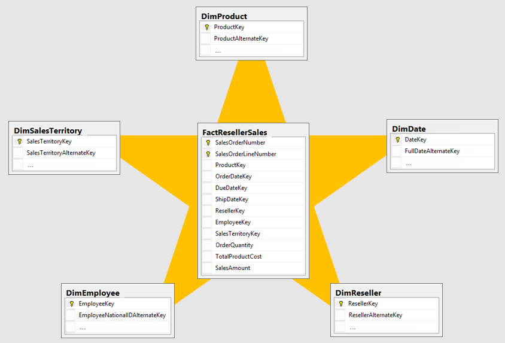
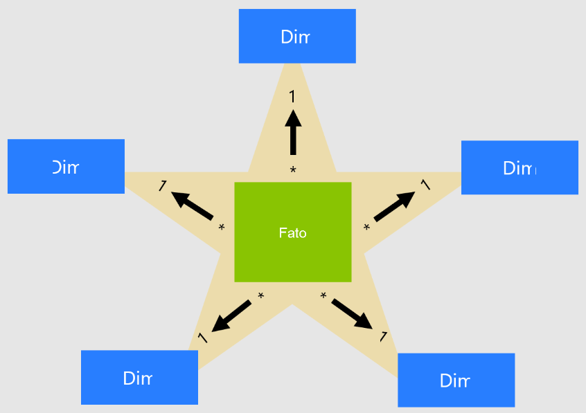

# Projeto Star Schema - MYSQL
Desenhar processo Star Schema no MySql 📔

## ⏳PROCESSO

- Foi utilizado o MySQL para criar o modelo dimensional - Star Schema.

## 📚 BREVE RESUMO - VISAO GERAL
O esquema em estrela é uma abordagem de modelagem madura amplamente adotada por data warehouses relacionais. Ele requer que os modeladores classifiquem suas tabelas de modelo como dimensão ou fato.

Tabelas de DIMENSÕES - descrevem as entidades de negócios – os itens que você modela. As entidades podem incluir produtos, pessoas, locais e conceitos, incluindo o próprio tempo. A tabela mais consistente que você encontrará em um esquema em estrela é uma tabela de dimensão de data. Uma tabela de dimensões contém uma ou mais colunas de chave, que atuam como um identificador exclusivo, e colunas descritivas.

Tabelas de FATOS - armazenam observações ou eventos e podem ser ordens de vendas, saldos de ações, taxas de câmbio, temperaturas, etc. Uma tabela de fatos contém colunas chave de dimensão relacionadas a tabelas de dimensões e colunas de medidas numéricas. As colunas de chave de dimensão determinam a dimensionalidade de uma tabela de fatos, enquanto os valores de chave de dimensão determinam a granularidade de uma tabela de fatos. Por exemplo, considere uma tabela de fatos projetada para armazenar os destinos de venda que têm duas colunas de chave de dimensão Data e ProductKey. É fácil entender que a tabela tem duas dimensões. No entanto, a granularidade não pode ser determinada sem considerar os valores de chave de dimensão. Neste exemplo, considere que os valores armazenados na coluna Data são o primeiro dia de cada mês. Nesse caso, a granularidade está no nível do mês-produto.

Em geral, as tabelas de dimensões contêm um número relativamente pequeno de linhas. As tabelas de fatos, por outro lado, podem conter um número muito grande de linhas e continuar crescendo ao longo do tempo.

## 🛠️ FERRAMENTAS

 

## 📚 REFERÊNCIAS

- [GIT. Documentation](https://git-scm.com/doc)
- [VSCODE. Download](https://code.visualstudio.com/)
- [VSCODE. Apender_usabilidade](https://code.visualstudio.com/learn)
- [VSCODE. Documentation](https://code.visualstudio.com/docs)
- [VSCODE. Atalhos_Keyboard](https://code.visualstudio.com/shortcuts/keyboard-shortcuts-windows.pdf)
- [Visão Geral. Documentation](https://learn.microsoft.com/pt-br/power-bi/guidance/star-schema)

## 📃 CERTIFICADO DE CONCLUSÃO
- [Criação do Modelo Star Schema - MYSQL](https://github.com/Car-Lopes/Projeto_DIO_PowerBI/tree/master/Desafio_5_Modelo_Star_Schema/Certificado)